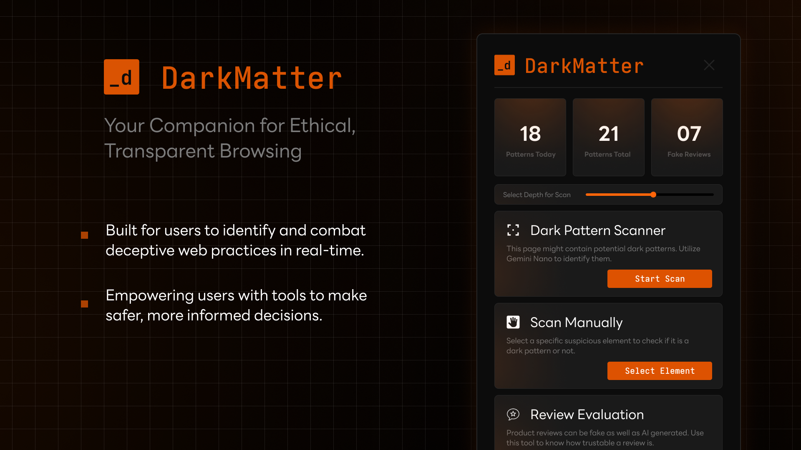

# DarkMatter



DarkMatter is a browser extension that empowers users to browse safely by detecting dark patterns, analyzing reviews for authenticity, and preventing clickjacking attacks. With AI-driven detection and user-friendly tools, it ensures a transparent and secure online experience, putting users back in control of their web interactions.


## Getting Started
The following instructions will guide you to set up and run DarkMatter locally on your browser for development and testing purposes.

### Browser Prerequisites
Currently the extension works on the latest Chrome canary builds. In order to use the chrome extension you must navigate to the following flags and change them as mentioned:

- Set `chrome://flags/#optimization-guide-on-device-model` to "Enabled BypassPerfRequirement"
- Set `chrome://flags/#translation-api` to "Enabled without language pack limit"
- Set  `chrome://flags/#text-safety-classifier` to "Disable"
- Set the following flags to "Enable"
    - `chrome://flags/#prompt-api-for-gemini-nano`
    - `chrome://flags/#summarization-api-for-gemini-nano`
    - `chrome://flags/#rewriter-api-for-gemini-nano`
    - `chrome://flags/#writer-api-for-gemini-nano`
    - `chrome://flags/#language-detection-api`

### Setup Instructions

- Ensure that you have node and npm installed 
- Clone the repo and navigate to DarkMatter
```bash
git clone https://github.com/4adex/dark.git
cd dark/DarkMatter
```
- Install dependencies and build the extension
```bash
npm install
npm run build
```
- A `dist` directory will be created in the path `dark/DarkMatter/dist`
- Load Unpacked the dist folder as extension directory from your Chrome canary or Chrome dev browser.
- The extension should now load as an unpacked extension.

## Made With
- Vite + React + TS
- Google Gemini nano APIs (Prompt API, Summarization API, Translation API)
- Google Chrome `sidebar` and `storage` functionality for extension


## Contributing
If you wish to contribute to this repo, contact the authors. Open a issue and get it assigned. Fork the repo, make changes and make PR against corresponding issue.

## License
This project is licensed under the MIT License - see the LICENSE file for details.


